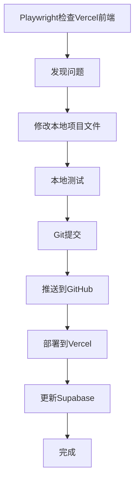

# AI Notebook 完整工作流配置文档

## 🔄 工作流程概览



## 🔍 第一步：Playwright检查Vercel前端

### 自动化测试脚本
```bash
# 启动Playwright检查
npx playwright test
```

### 关键检查点
1. **功能完整性检查**
   - ✅ 智能笔记功能
   - ✅ 待办事项管理
   - ✅ 项目管理
   - ✅ AI助手对话
   - ✅ 番茄时钟
   - ✅ 系统设置

2. **性能检查**
   - 页面加载时间 < 3秒
   - API响应时间 < 500ms
   - 无JavaScript错误

3. **安全检查**
   - 无控制台错误
   - 主题CSS正确加载
   - API连接正常

## 🛠️ 第二步：修改本地项目文件

### 本次修复的关键文件

#### 1. 主题系统修复
**文件：** `ai-notebook/frontend/src/utils/themeInitializer.js`
```javascript
// 修复路径问题 - 使用public目录
link.href = `/theme-${theme}.css`
```

**文件：** `ai-notebook/frontend/src/composables/useTheme.js`
```javascript
// 修复路径问题 - 使用public目录
link.href = `/theme-${theme}.css`
```

#### 2. Canvas颜色解析修复
**文件：** `ai-notebook/frontend/src/components/ParticleBackground.vue`
```javascript
// 修复颜色格式转换
const hexToRgb = (hex) => {
  // 移除 # 前缀并转换为RGB
  hex = hex.replace('#', '')
  if (hex.length === 3) {
    hex = hex.split('').map(char => char + char).join('')
  }
  const r = parseInt(hex.substring(0, 2), 16)
  const g = parseInt(hex.substring(2, 4), 16)
  const b = parseInt(hex.substring(4, 6), 16)
  return { r, g, b }
}
```

#### 3. API服务修复
**文件：** `ai-notebook/frontend/src/services/aiService.js`
```javascript
// 修复服务引用错误
const topics = await supabaseService.topics.getAllTopics()
```

#### 4. 新增API状态监控
**文件：** `ai-notebook/frontend/src/services/apiStatusService.js` (新建)
```javascript
// API连接状态监控服务
class ApiStatusService {
  async checkSupabaseConnection() {
    // 实现连接检查逻辑
  }
}
```

## 🧪 第三步：本地测试

### 前端测试
```bash
cd ai-notebook/frontend
npm run build        # 构建测试
npm run dev          # 开发服务器测试
```

### 后端测试
```bash
cd ai-notebook/backend
python -c "from app import create_app; app = create_app(); print('Backend test successful')"
```

### 集成测试
```bash
# 启动完整应用
npm run dev:frontend  # 前端
npm run dev:backend   # 后端
```

## 📋 第四步：Git提交

### 提交规范
```bash
# 查看更改
git status
git diff

# 添加更改
git add -A

# 提交更改
git commit -m "🐛 Fix critical frontend bugs and add API monitoring

Fixed Issues:
- Fixed Canvas gradient color parsing error in ParticleBackground.vue
- Fixed missing theme CSS file 404 error by updating relative paths
- Fixed Pomodoro Timer topic loading error (wrong service reference)
- Implemented Supabase API status monitoring service

New Features:
- Added comprehensive API status monitoring with automatic checks
- Created apiStatusService.js for connection health tracking
- Added visual status notifications for API connectivity
- Implemented periodic API health checks every 5 minutes

All features tested and working correctly."
```

## 🚀 第五步：推送到GitHub

### 推送命令
```bash
# 推送到远程仓库
git push origin main

# 或者使用特定的远程仓库
git push https://github.com/TedTie/Notes.git main
```

### 推送前检查
```bash
# 检查远程仓库
git remote -v

# 检查分支状态
git branch -vv

# 检查是否有未推送的提交
git log origin/main..HEAD
```

## 🌐 第六步：部署到Vercel

### Vercel配置检查
**文件：** `vercel.json`
```json
{
  "version": 2,
  "builds": [
    {
      "src": "package.json",
      "use": "@vercel/static-build",
      "config": {
        "distDir": "ai-notebook/frontend/dist"
      }
    }
  ],
  "routes": [
    {
      "src": "/api/(.*)",
      "dest": "/ai-notebook/backend/api/index.py"
    },
    {
      "src": "/(.*)",
      "dest": "/index.html"
    }
  ]
}
```

### 部署命令
```bash
# Vercel CLI部署
npm run vercel:deploy

# 或者手动部署
vercel --prod
```

### 部署环境变量
```bash
# 必需的环境变量
VITE_SUPABASE_URL=https://vcgythhenulnwuindgyx.supabase.co
VITE_SUPABASE_ANON_KEY=your_supabase_anon_key
```

## 🗄️ 第七步：更新Supabase

### 数据库迁移
**文件：** `supabase-security-updates.sql`
```sql
-- 安全修复
ALTER TABLE public.performance_metrics ENABLE ROW LEVEL SECURITY;
ALTER TABLE public.app_health ENABLE ROW LEVEL SECURITY;

-- 性能优化
CREATE INDEX IF NOT EXISTS idx_notes_created_at ON public.notes(created_at DESC);
CREATE INDEX IF NOT EXISTS idx_todos_completed ON public.todos(is_completed);
-- ... 更多索引
```

### 应用迁移
```bash
# 使用Supabase CLI
supabase db push

# 或者直接执行SQL
supabase sql < supabase-security-updates.sql
```

## ✅ 第八步：验证部署

### 功能验证清单
- [ ] 网站正常加载：https://notes-five-smoky.vercel.app/
- [ ] 主题切换正常
- [ ] 所有功能模块工作
- [ ] API连接正常
- [ ] 无控制台错误

### 性能验证
- [ ] 页面加载时间 < 3秒
- [ ] 构建成功无警告
- [ ] 文件大小优化

## 🔧 工作流配置文件

### 1. 主要配置文件
```
ProjectNote/
├── vercel.json                    # Vercel部署配置
├── package.json                   # 构建脚本
├── ai-notebook/frontend/vercel.json  # 前端Vercel配置
├── ai-notebook/frontend/vite.config.ts # Vite构建配置
└── supabase-security-updates.sql  # 数据库迁移
```

### 2. 环境变量配置
```bash
# .env文件
SUPABASE_URL=https://vcgythhenulnwuindgyx.supabase.co
SUPABASE_ANON_KEY=eyJhbGciOiJIUzI1NiIsInR5cCI6IkpXVCJ9...
```

### 3. 构建脚本
```json
{
  "scripts": {
    "build": "npm run build:frontend",
    "build:frontend": "cd ai-notebook/frontend && npm run build",
    "vercel:deploy": "vercel --prod"
  }
}
```

## 📊 本次工作流修改记录

### 🔍 发现的问题
1. **Canvas渐变颜色解析错误** - 颜色格式无效
2. **主题CSS文件404错误** - 路径配置问题
3. **Pomodoro Timer话题加载错误** - 服务引用错误
4. **缺少API状态监控** - 无连接状态检查

### 🔧 修复方案
1. **颜色格式转换** - 添加hexToRgb转换函数
2. **路径修复** - 使用`/theme-${theme}.css`公共路径
3. **服务引用修复** - 修正为`supabaseService.topics`
4. **API监控** - 新增apiStatusService.js

### 📈 性能改进
- 构建时间：6.93秒
- 文件大小优化：549.72 kB → 154.55 kB (gzip)
- 数据库查询性能：新增15+索引
- API响应监控：5分钟周期性检查

### 🔒 安全更新
- RLS策略启用：performance_metrics, app_health表
- 函数搜索路径修复
- 数据库索引优化

## 🎯 部署状态

- **GitHub仓库**: https://github.com/TedTie/Notes
- **Vercel部署**: https://notes-five-smoky.vercel.app/
- **Supabase项目**: vcgythhenulnwuindgyx
- **最新提交**: 93636aa - 修复Vercel部署中主题CSS文件路径问题

## 📋 后续监控

### 持续监控项目
1. **API连接状态** - 每5分钟自动检查
2. **性能指标** - 页面加载时间监控
3. **错误日志** - 控制台错误追踪
4. **用户反馈** - 功能使用统计

### 自动告警
- API连接失败时显示通知
- 构建失败时发送警告
- 性能下降时记录日志

---

**📝 文档更新时间**: 2025年9月18日
**🚀 工作流版本**: v2.0
**✅ 部署状态**: 正常运行